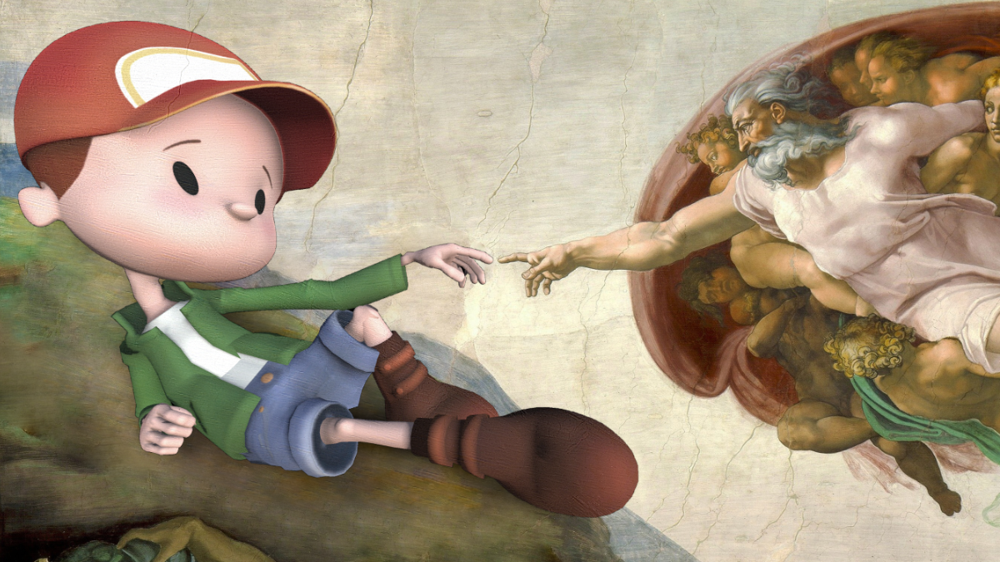

# Bringing your imaginary friend to life with HoloLens

Talk given at these event(s):
  * Global XR Conference, 2 December 2021  

## Development environment

* Unity 2020.3.11f1
* MRTK 2.7.2 with OpenXR

